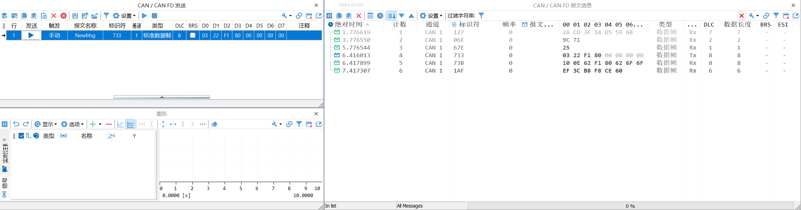
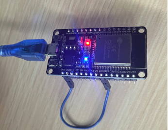
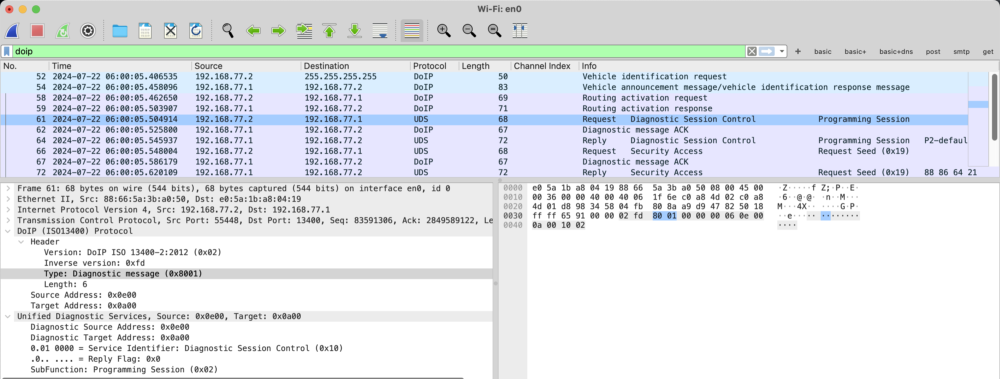
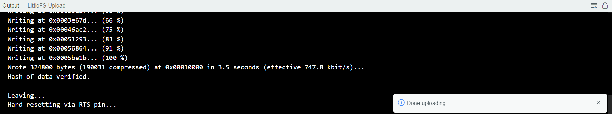
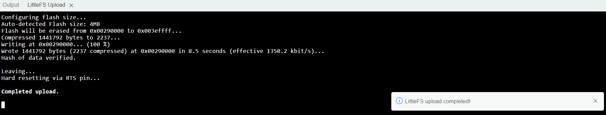
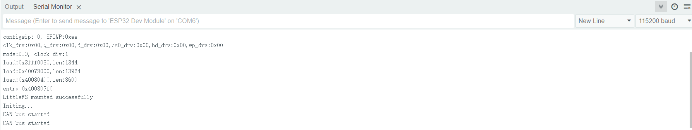

# uds-server-simulator - ESP32

Based on [uds-server-simulator](https://github.com/Honinb0n/uds-server-simulator), a configurable CAN/DoIP UDS simulator for ESP32 (ESP-WROOM-32).

Simulatable services:

- 0x10: Diagnostic Session Control
- 0x22: ReadDataByIdentifier
  - not support multi-did data read
- 0x27: Security Access
- 0x2E: WriteDataByIdentifier
- 0x2F: InputOutputControlByIdentifier
- 0x34: RequestDownload
- 0x35: RequestUpload
- 0x36: TransferData
- 0x37: RequestTransferExit
- 0x3E: TesterPresent


## Build & Flash

1. Download latest release: https://github.com/ex7l0it/uds-server-simulator-esp32/releases
2. Unzip, edit the `data\config.json`
3. Connect the ESP32 to PC
4. Run the `flash.bat`
5. Done.


## Configration file

The file `config.json` defines every ECU's information which needs to be initialized.

The `CURRENT_ECU` specifies which ECU the server should simulate.

The `RANDOM_FRAME` controls whether random CAN data generation is enabled.

You can also add custom ECU information with the following fields:

- **Mandatory**
  - `func_req_id`: can be set to "0x7DF", or an empty string.
  - `phy_req_id`: e.g. "0x703"
  - `phy_resp_id`: e.g. "0x7A3"
- **Optional**
  - format: {"DID": "DATA", ...}
    - `DID_No_Security`: These DIDs can be read and written without authentication.
    - `DID_Security_03`: These DIDs can be read without authentication but require 2703 authentication for writing.
    - `DID_Security_19`: These DIDs can be read without authentication but require 2719 authentication for writing.
    - `DID_Security_21`: These DIDs require 2721 authentication for reading and writing.
  - format: [DID1, DID2, ...]
    - `DID_IO_Control`: The IO operation corresponding to the DID must be controlled with 27 authentication.

Examples:

```
{   
    "CURRENT_ECU": "GW",
    "RANDOM_FRAME": true,
    "GW": {
        "func_req_id": "",
        "phy_req_id": "0x703",
        "phy_resp_id": "0x7A3",
        "DID_No_Security": {
            "0xF18B": "2023.06.23"
        },
        "DID_Security_03": {
            "0xF180": "boot v1.0.1", 
            "0xF187": "GW v1.1.1"
        },
        "DID_Security_19": {
            "0xF190": "LUAU2AUB3GE383467",
            "0xF197": "GW"
        },
        "DID_Security_21": {
            "0xFA19": "SecurityData"
        },
        "DID_IO_Control": []
    }
}
```


## Usage

### CAN + UDS

Use PCAN + CAN Transceiver + TS Master / PCAN-View (Demo sample ECU is the`TBOX` in default `config.json`)

| ESP32 pin | CAN Transceiver pin |
| --------- | ------------------- |
| 3V3       | 3.3V                |
| GND       | GND                 |
| D4        | CAN RX              |
| D5        | CAN TX              |



### DoIP + UDS

Connect the 3.3V pin to the D18 pin, then press the reset button, if you see the blue LED light up, it means in DoIP mode.



Connect to the AP (SSID: ESP32_DoIP, Password: `12345678`), then you can connect to the 13400 port.



### Upload / Download

Request Download / Upload available address space: `0x0000-0xFFFF`

- eg. `733#0734002200000019`
  - `0022`: fixed hard-coded: uncompressed and unencrypted, memoryAddressLength and memorySizeLength are both 2 bytes
  - `0000`: memoryAddress
  - `0019`: memorySize


## Development

1. Clone this repo

```shell
git clone https://github.com/ex7l0it/uds-server-simulator-esp32.git
```

2. Open this project by Arduino IDE 2.x.

3. Configure the Arduino IDE to support ESP32:

   - File - Preferences... - Additional boards manager URLs: `https://espressif.github.io/arduino-esp32/package_esp32_index.json`

   - Open Board managers, search `esp32` and install the **esp32** by Espressif Systems (2.0.17)
     - ⚠️ Note that the version installed here needs to be 2.x

    - Install the LittleFS Uploader Plugin on Arduino IDE 2
      - [LittleFS Uploader Plugiin](https://github.com/earlephilhower/arduino-littlefs-upload)
      - [Install guide](https://randomnerdtutorials.com/arduino-ide-2-install-esp32-littlefs/)

4. Select `ESP32 Dev Module` and then click the Upload button.

   

5. Edit `data/config.json`, make the changes you need.

6. Press [**Ctrl**] + [**Shift**] + [**P**] , click **Upload Little FS to Pico/ESP8266/ESP32**

   - ⚠️ Note that need to close the Serial Monitor when uploading

   

7. Press ESP32 reset button, all work done.




## Acknowledgments

The software refers to some excellent open source projects.

Special thanks to:

- uds-server-simulator: https://github.com/Honinb0n/uds-server-simulator
- ESP32-TWAI-CAN: https://github.com/handmade0octopus/ESP32-TWAI-CAN


## License

GNU General Public License v2.0